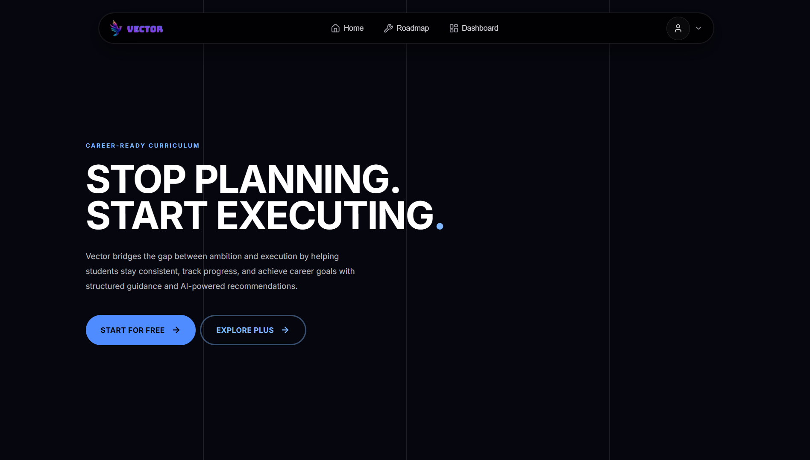
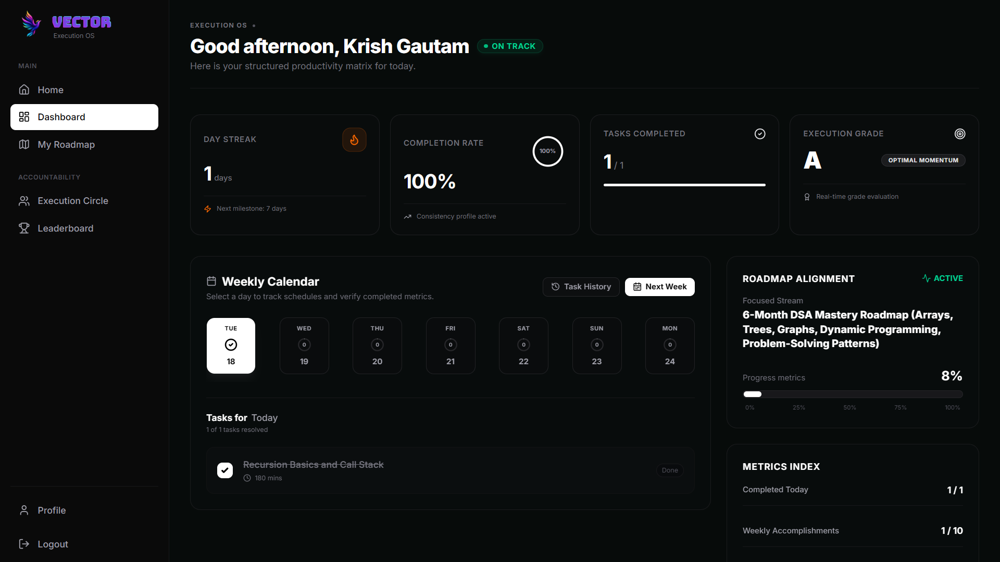
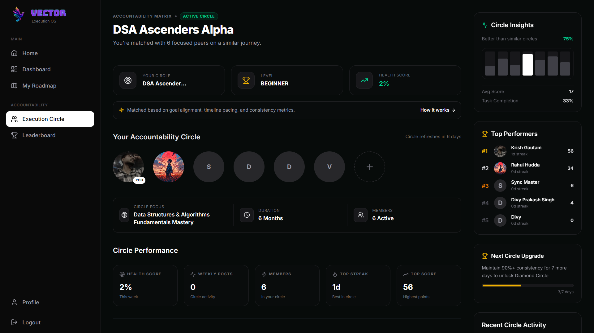
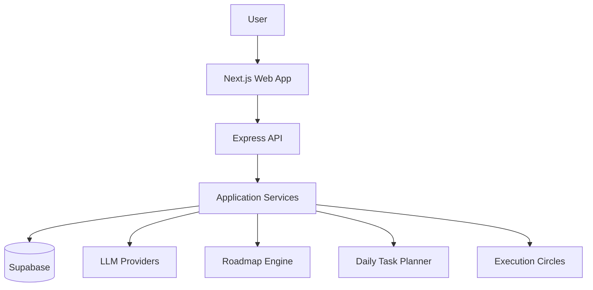

<div align="center">

# Vector

**Turn ambitious goals into structured, daily-executable roadmaps.**


<p><i>Most goal-planning tools tell you <b>what</b> to learn. Vector tells you what to do today — and whether you're actually on pace.</i></p>

<h3><a href="https://vectorai.me">Build Your Roadmap at vectorai.me →</a></h3>

<br>

</div>

---

## The Problem: Knowing the Goal Isn't the Hard Part

"Become a full-stack developer." "Crack DSA." "Get placement-ready in 6 months."

Everyone can *name* the goal. What breaks people is the next question: **what do I actually do today, tomorrow, and the day after — given the two hours I actually have, not the ten I wish I had?**

Most tools stop at a static list of topics and leave you to turn that into a schedule yourself. Vector was built to close that gap: it takes your goal, your current level, and your real available time, and turns it into an execution system —

```
Goal  →  Personalized Roadmap  →  Phases  →  Daily Tasks  →  Progress
```

— not a reading list you'll abandon in a week.

<p align="center">
  
</p>

---

## Step 1: Generation That Actually Fits *You*

Two people with the identical goal of "learn DSA" but different starting points shouldn't get the same plan. Vector's generation engine takes your **goal, current skill level, and available daily time** and produces a roadmap sized to fit — not a generic template with your name on it.

Every generated roadmap is broken into logical **phases**, and every phase into concrete tasks, so you're never staring at one overwhelming wall of topics:

```text
Roadmap
 ├── Phase 1 → Task 1, Task 2, Task 3
 ├── Phase 2 → Task 4, Task 5
 └── Phase 3 → ...
```

---

## Step 2: From Plan to Daily Execution

A roadmap you never open again is worthless. Vector converts the plan into **daily tasks**, sized to your available time, and tracks how consistently you're actually showing up — turning "I have a plan" into "I know exactly what to do in the next hour."

Scheduling is **timezone-aware**: your "today" is computed from *your* clock, not the server's, so the plan never drifts out of sync with your actual day.

<p align="center">
  
  <br><em>Execution view — completion, pace, and consistency at a glance</em>
</p>

---

## step 3: Accountability, Built In

Solo goals die quietly. **Execution Circles** match you with other people working toward similar goals, so pace and consistency stop being a private struggle and become something you're actually accountable for.

<p align="center">
  
  <br><em>Execution Circles — shared accountability for shared goals</em>
</p>

---

## Under the Hood: What Makes It Not Fall Over

This is the part most goal-tracker READMEs skip, and it's where most of the actual engineering time went. Treating AI output as trustworthy application data is a good way to ship a broken product.

**🧪 LLM output is guilty until proven innocent.** Every generated roadmap is schema-validated and checked against your available time *before* it's allowed to touch the database. If it's not realistic, it doesn't get persisted.

**🔒 Generation is locked, not racy.** Re-triggering generation mid-request could otherwise create duplicate or conflicting roadmap state — a generation lock stops concurrent attempts from stepping on each other.

**🧩 Multi-stage failures don't leave orphaned data.** Generation runs through goal processing → AI call → validation → persistence → task planning → dashboard state. If it fails halfway, the backend tracks status and cleans up instead of leaving half-built roadmaps behind.

**🔐 Auth doesn't stop at the browser.** Frontend and backend are separate services — every protected API route independently verifies the session token server-side before touching user data.

---

## Architecture



| Layer | Technology |
|---|---|
| Frontend | Next.js, React, TypeScript, Tailwind CSS |
| Backend | Node.js, Express |
| Database & Auth | Supabase |
| AI | OpenAI / Groq |
| Deployment | Vercel (frontend) · Render (backend) |

---

## What's Next

- Adaptive roadmaps that adjust based on actual performance, not just the initial plan
- Recovery planning when you fall behind pace
- Roadmap template reuse to cut redundant AI generation
- Deeper execution analytics
- Smarter Execution Circle matching

---

<div align="center">

### [Stop planning. Start executing — vectorai.me](https://vectorai.me)

> The source is maintained in a private repository. This public repo exists as a product and engineering showcase.

<br>

**Krish Gautam** · B.Tech, NIT Kurukshetra

[LinkedIn](https://www.linkedin.com/in/krish-gautam-4662b7334/) · [GitHub](https://github.com/Krish-Gautam/)

</div>