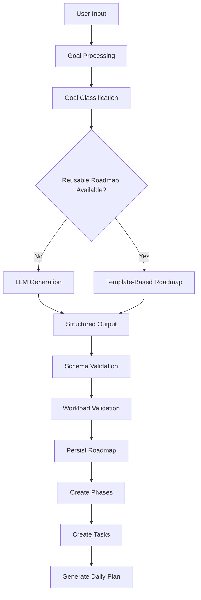
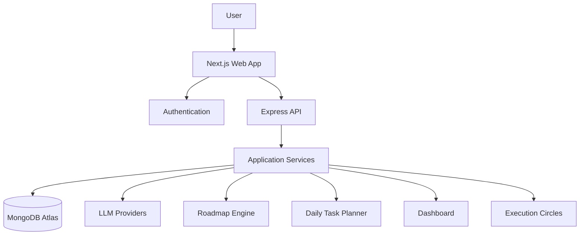

# Vector

<p align="center">
  <strong>Turn ambitious goals into structured, actionable roadmaps.</strong>
</p>

<p align="center">
  Vector is an AI-powered goal planning and execution platform that transforms a user's goal, skill level, available time, and target duration into a personalized roadmap with structured phases, daily tasks, and progress tracking.
</p>

<p align="center">
  <a href="https://vectorai.me">Live Demo</a>
  &nbsp;•&nbsp;
  <a href="#features">Features</a>
  &nbsp;•&nbsp;
  <a href="#architecture">Architecture</a>
  &nbsp;•&nbsp;
  <a href="#engineering-challenges">Engineering</a>
</p>

---

## Product Preview

### Landing Page


Vector is designed around a simple idea: **a goal is only useful when it can be converted into consistent execution.**

### Personalized Roadmap


Users provide their goal, current level, target duration, and available daily time. Vector converts these constraints into a structured roadmap with phases and actionable tasks.

### Progress Dashboard


The dashboard turns roadmap activity into an execution view, helping users understand what they have completed, what remains, and how consistently they are progressing.

> More product screenshots are available throughout this README.

---

## Why Vector?

Most learning and productivity tools stop at **what** someone should learn.

They provide a list of topics, courses, or resources, but rarely answer:

* What should I do first?
* How much should I study each day?
* How should the plan fit my current skill level?
* What should I work on today?
* Am I actually making progress?

Vector was built to bridge that gap.

Instead of giving users another static checklist, Vector attempts to turn a vague objective into an **execution system**:

**Goal → Personalized Roadmap → Phases → Tasks → Daily Execution → Progress**

---

## How It Works


### 1. Define a goal

The user provides a goal such as:

> "Become a full-stack developer"

along with their current level, available study time, and target duration.

### 2. Generate a roadmap

Vector processes the user's inputs and generates a structured plan designed around their constraints.

### 3. Break the roadmap into phases

The generated plan is organized into logical phases instead of presenting users with one large list of topics.

### 4. Convert phases into actionable tasks

The roadmap is translated into smaller tasks that can be scheduled and completed.

### 5. Execute and track

Users work through their daily tasks while Vector tracks progress and execution activity.

---

# Features

## AI-Powered Roadmap Generation

Vector uses LLM-based generation to transform high-level goals into structured learning or execution plans.

The generation pipeline considers factors such as:

* Goal
* Current skill level
* Available daily time
* Target duration
* Roadmap structure

The generated output is then validated before being persisted.

---

## Personalized Learning Paths

Two users with the same goal may have completely different starting points and available time.

Vector therefore uses user-specific constraints when constructing the roadmap rather than treating every user as starting from the same point.

---

## Structured Roadmaps

Instead of a flat checklist, each roadmap is organized into:

```text
Roadmap
 ├── Phase 1
 │    ├── Task 1
 │    ├── Task 2
 │    └── Task 3
 │
 ├── Phase 2
 │    ├── Task 4
 │    └── Task 5
 │
 └── Phase 3
      └── ...
```

This gives users a clear progression from their current state toward their target.

---

## Daily Task Planning

Vector converts the roadmap into actionable daily work based on the user's available study time.

This is an important distinction between simply **generating a roadmap** and actually helping a user **execute it**.


---

## Progress Tracking

Users can track roadmap completion and task execution through the dashboard.


The system aggregates task and roadmap data to provide a higher-level view of execution.

---

## Execution Circles

Vector also includes an accountability layer through **Execution Circles**.

Users can be matched with other users working toward similar goals, creating a shared environment for accountability and progress.


---

## Timezone-Aware Scheduling

Daily task planning takes the user's timezone into account instead of relying solely on the server's date.

This prevents a user's daily schedule from becoming inconsistent when the application server and user are operating in different timezones.

---

# AI Roadmap Generation Pipeline

The roadmap generator is one of the most technically important parts of Vector.



### Generation flow

**1. Collect user constraints**

The system collects the goal, current level, duration, and available daily time.

**2. Process the goal**

The goal is refined and classified to help determine an appropriate generation path.

**3. Reuse existing roadmap structures when possible**

Where supported, Vector can use existing roadmap structures rather than generating everything from scratch.

**4. Generate with an LLM**

When a suitable structure is unavailable, the backend generates a structured roadmap using an LLM.

**5. Validate the output**

The generated data is validated before being stored.

This is important because LLM output cannot simply be treated as trusted application data.

**6. Validate workload**

The system checks whether the generated roadmap provides a reasonable amount of work relative to the user's available time.

**7. Persist the roadmap**

Once validated, the roadmap, phases, and tasks are stored and the user's execution plan can be initialized.

---

# Architecture



## Frontend

Built with:

* Next.js
* React
* TypeScript
* Tailwind CSS

The frontend handles the user-facing experience including onboarding, roadmap visualization, dashboard views, daily tasks, authentication, and Execution Circles.

## Backend

The backend is built around a Node.js/Express API and separates product functionality into application modules such as:

* Roadmap generation
* AI processing
* Daily task planning
* Dashboard aggregation
* Profile management
* Execution Circles

## Database

The production application uses MongoDB Atlas for persistent application data.

The data model represents concepts such as:

* Users
* Goals
* Roadmaps
* Roadmap phases
* Tasks
* Daily tasks
* Execution Circles
* User activity

## Authentication

Authentication is handled through Supabase Auth, while protected API requests are validated on the server before accessing user-specific resources.

## AI Layer

Vector integrates LLM providers for goal processing and roadmap generation.

The AI layer is separated from the rest of the application so that generation logic can evolve independently from the UI.

---

# Engineering Challenges

Vector was not simply a UI project. A significant part of the work involved handling the problems that appear when AI-generated data is used inside a real application.

## 1. Unreliable LLM Output

### Problem

LLMs can return incomplete, malformed, or poorly scoped roadmap data.

### Approach

Vector validates generated output before allowing it to become application state and performs workload checks against the user's available study time.

### Why it matters

The application treats AI as a **component of the system**, not as a source of unquestioned truth.

---

## 2. Preventing Duplicate Roadmap Generation

### Problem

Users can potentially trigger generation multiple times while a previous generation is still running.

That can lead to duplicate or inconsistent roadmap state.

### Approach

Vector uses a generation lock around the roadmap creation process so that concurrent generation attempts can be controlled.

---

## 3. Timezone-Aware Scheduling

### Problem

Using server-local dates for daily tasks can produce incorrect schedules for users in different timezones.

### Approach

Task scheduling uses the user's timezone when determining daily execution dates.

---

## 4. Authentication Across Frontend and Backend

### Problem

The frontend and backend are separate services, so authentication cannot stop at the browser.

### Approach

The frontend obtains the authenticated session while protected API routes validate the user's bearer token on the server.

This keeps user-specific roadmap and dashboard operations behind authenticated API boundaries.

---

## 5. Coordinating AI Generation With Application State

Roadmap generation involves multiple stages:

```text
Request
  ↓
Goal Processing
  ↓
AI Generation
  ↓
Validation
  ↓
Database Persistence
  ↓
Task Planning
  ↓
Dashboard State
```

Failure at any stage can leave partially created data.

The backend therefore includes status tracking, cleanup/error handling, and generation-state management to keep the application consistent.

---

# Tech Stack

| Layer               | Technology                 |
| ------------------- | -------------------------- |
| Frontend            | Next.js, React, TypeScript |
| Styling             | Tailwind CSS               |
| Backend             | Node.js, Express           |
| Database            | MongoDB Atlas              |
| Authentication      | Supabase Auth              |
| AI                  | OpenAI / Groq              |
| Frontend Deployment | Vercel                     |
| Backend Deployment  | Render                     |

---

# Project Structure

```text
vector/
├── apps/
│   ├── web/
│   │   ├── app/
│   │   ├── components/
│   │   ├── lib/
│   │   └── types/
│   │
│   └── api/
│       └── src/
│           ├── modules/
│           │   ├── ai/
│           │   ├── auth/
│           │   ├── dashboard/
│           │   ├── dailytask/
│           │   ├── executioncircle/
│           │   ├── profile/
│           │   └── roadmap/
│           │
│           └── data/
│
├── package.json
├── pnpm-workspace.yaml
└── README.md
```

The exact structure may evolve as the project grows; the important separation is between the user-facing web application and backend application services.

---

# Deployment

Vector is deployed as a production web application.

```text
                    ┌─────────────────┐
                    │   User Browser  │
                    └────────┬────────┘
                             │
                             ▼
                    ┌─────────────────┐
                    │     Vercel      │
                    │   Next.js App   │
                    └────────┬────────┘
                             │
                             ▼
                    ┌─────────────────┐
                    │  Express API    │
                    │     Render      │
                    └──────┬─────┬────┘
                           │     │
                ┌──────────┘     └──────────┐
                ▼                           ▼
        ┌──────────────┐             ┌─────────────┐
        │ MongoDB Atlas│             │ AI Providers│
        └──────────────┘             └─────────────┘
```

### Live Application

**[Visit Vector →](https://vectorai.me)**

---

# Screenshots

Additional screenshots can be added to:

```text
assets/
└── screenshots/
    ├── landing-page.png
    ├── onboarding.png
    ├── generated-roadmap.png
    ├── daily-tasks.png
    ├── progress-dashboard.png
    └── execution-circle.png
```

Recommended screenshots:

| Screenshot        | What it should demonstrate         |
| ----------------- | ---------------------------------- |
| Landing Page      | Product positioning and UI quality |
| Onboarding        | User inputs and personalization    |
| Generated Roadmap | Core AI output                     |
| Daily Tasks       | Turning roadmap into execution     |
| Dashboard         | Progress and tracking              |
| Execution Circle  | Accountability/community feature   |

The **generated roadmap** and **dashboard** should be your strongest screenshots because they communicate the actual product value better than the landing page alone.

---

# Future Improvements

Potential directions for Vector include:

* More adaptive roadmap generation based on actual user performance
* Better recovery planning when users fall behind
* Improved roadmap retrieval and reuse
* Deeper execution analytics
* More sophisticated Execution Circle matching
* Richer accountability and social features
* Stronger admin and moderation tooling

---

# Why I Built Vector

I built Vector around a simple problem:

**Knowing what you want to achieve is easy. Knowing what to do every day to get there is much harder.**

The goal was to build more than an AI chatbot that generates a list of topics.

Vector combines AI-generated planning with structured tasks, scheduling, progress tracking, and accountability to create a system that helps users move from **intention to execution**.

The project also gave me an opportunity to work through practical engineering problems involving AI reliability, backend architecture, authentication, scheduling, data consistency, and production deployment.

---

# Author

**Krish Gautam**

B.Tech — NIT Kurukshetra

* LinkedIn: `YOUR_LINKEDIN_URL`
* GitHub: `YOUR_GITHUB_URL`
* Portfolio: `YOUR_PORTFOLIO_URL`

---

## Live Demo

**[vectorai.me](https://vectorai.me)**

> The source code is maintained in a private repository. This public repository is intended as a product and engineering showcase containing the project's documentation, architecture, screenshots, and technical overview.
